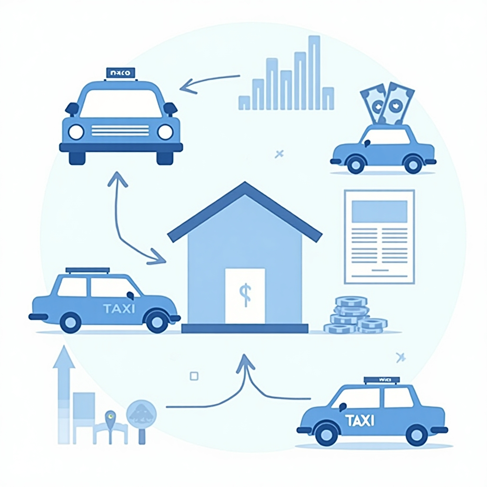
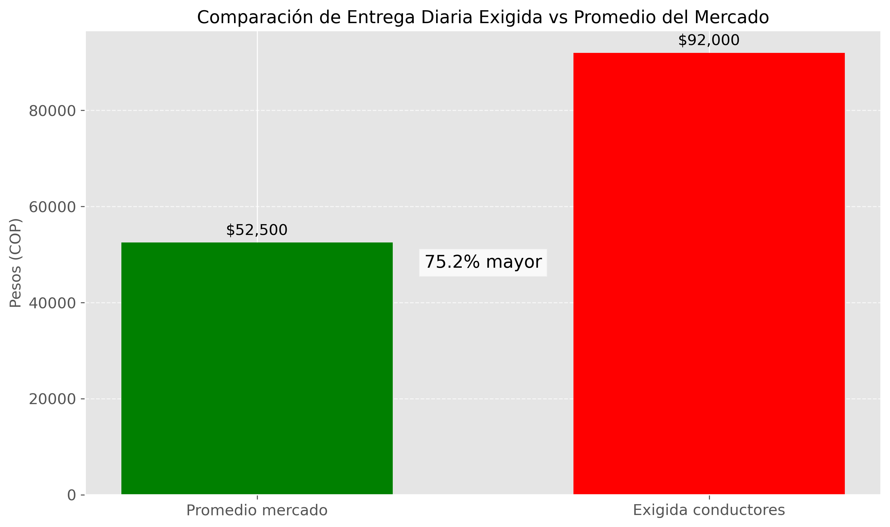
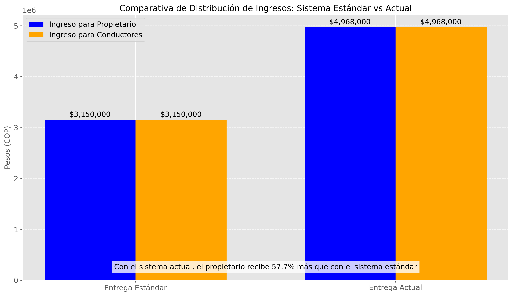
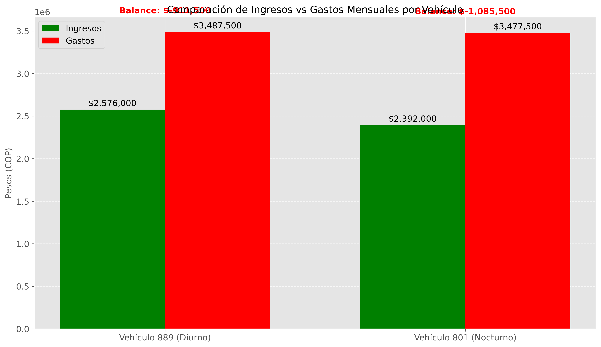
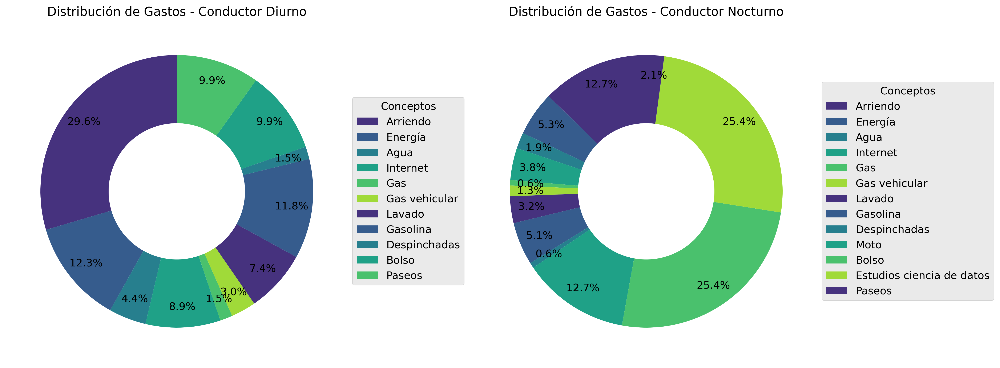
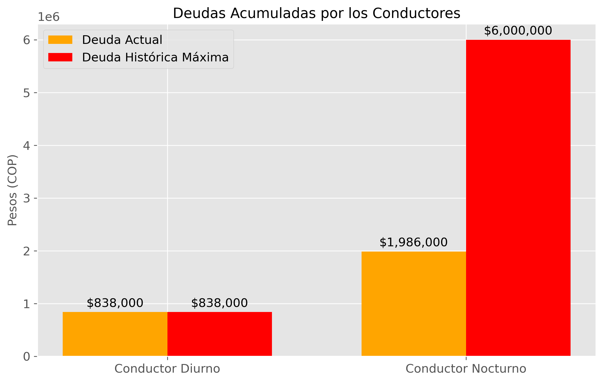
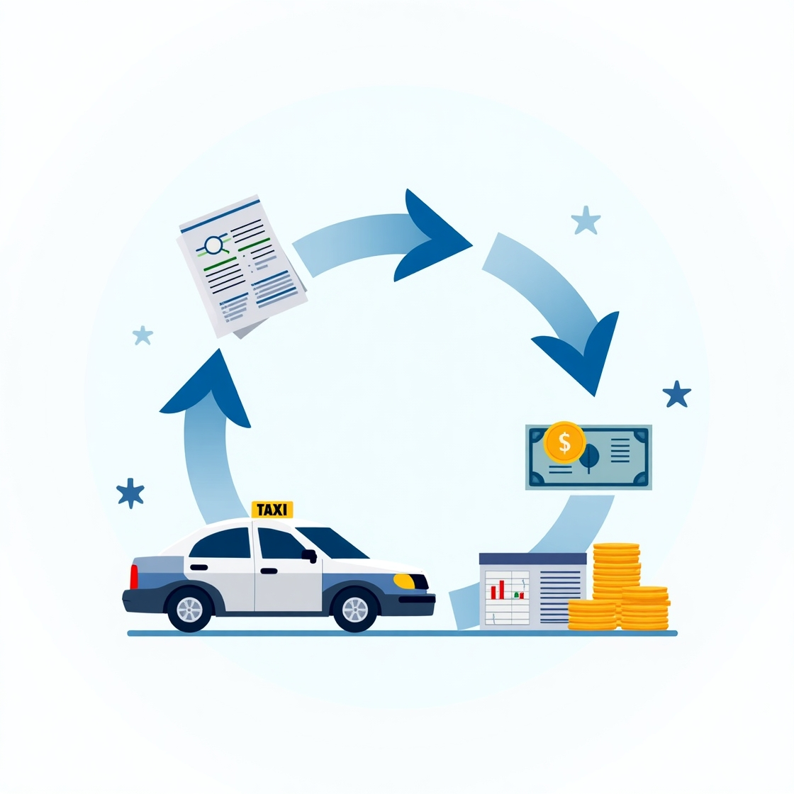

# 📊 Proyecto de Ciencia de Datos: Sociedad Venecia – Análisis Financiero de Taxis 🚖💰

## 📘 Descripción

Este proyecto analiza el flujo financiero de dos taxis pertenecientes a una pequeña sociedad en Colombia. A partir de registros manuales en papel, se digitalizó la información para evaluar ingresos, egresos, deudas y reparaciones. El análisis permite detectar patrones, evaluar la rentabilidad y simular escenarios estratégicos como el ingreso a plataformas como Uber o DiDi.

---

## ⚙️ Tecnologías utilizadas

- Python
- Pandas
- Matplotlib
- Seaborn
- Jupyter Notebook

---

## 🔍 Análisis del Proyecto

### 1. Organización y Estructuración de los Datos

Los datos fueron inicialmente recopilados a mano, en hojas sueltas y en condiciones poco estructuradas. Se realizó un trabajo meticuloso de digitalización y limpieza para poder analizarlos con herramientas de ciencia de datos.

---

### 2. Exploración y Visualización Financiera

Se crearon visualizaciones clave para identificar el comportamiento mensual de ingresos, egresos y entregas a los socios. También se analizaron las reparaciones y su impacto financiero.

#### Comparación de entregas mensuales recibidas contra el estandar

#### Visualización de gastos y reparaciones

#### Visualización de ingresos vs gastos

---

### 3. Evaluación Financiera y desempeño de conductores

Seobserva y estudian las finanzas y comportamientos de los conductores de los vehiculos para estudiar el impacto que esto podria tener en la economia de la sociedad y los taxis.

------

### 4. Evaluación Financiera y Escenarios

Se calcularon indicadores clave como la rentabilidad mensual por taxi, la evolución de las deudas, y el impacto acumulado de reparaciones. Además, se evaluaron decisiones estratégicas hipotéticas como la venta de un taxi y la integración a plataformas de movilidad.

---

## ✅ Conclusiones

El análisis financiero permitió identificar oportunidades de mejora operativa y financiera. Se comprobó que decisiones como digitalizar registros o entrar a plataformas podrían optimizar significativamente los ingresos de los socios.

---

## 🔜 Próximos Pasos

- Implementar un sistema digital para el registro de datos.
- Simular ingresos reales usando plataformas como Uber o DiDi.
- Continuar con el análisis periódico de los datos para mejorar la toma de decisiones.
